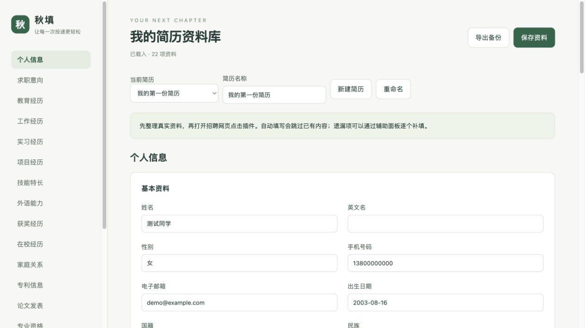
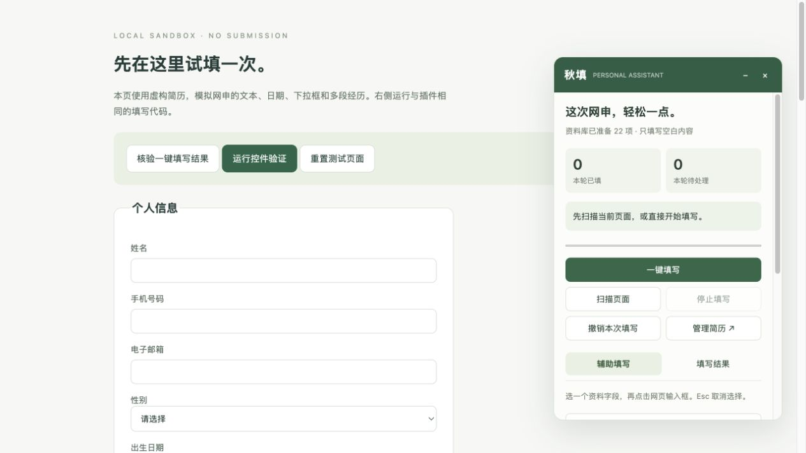
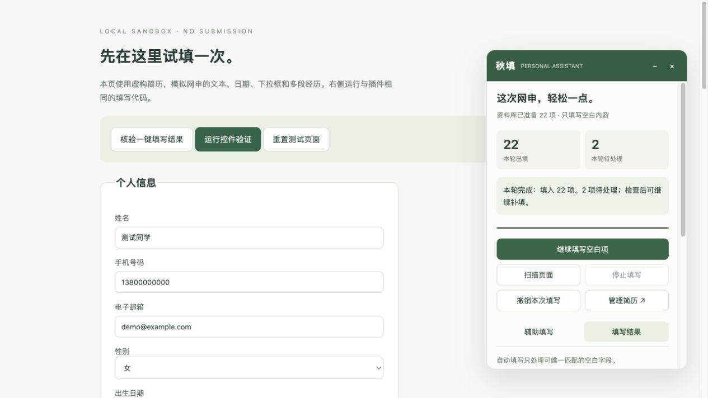
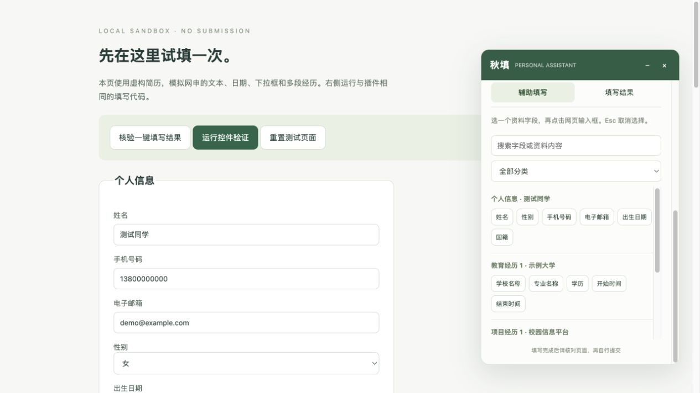
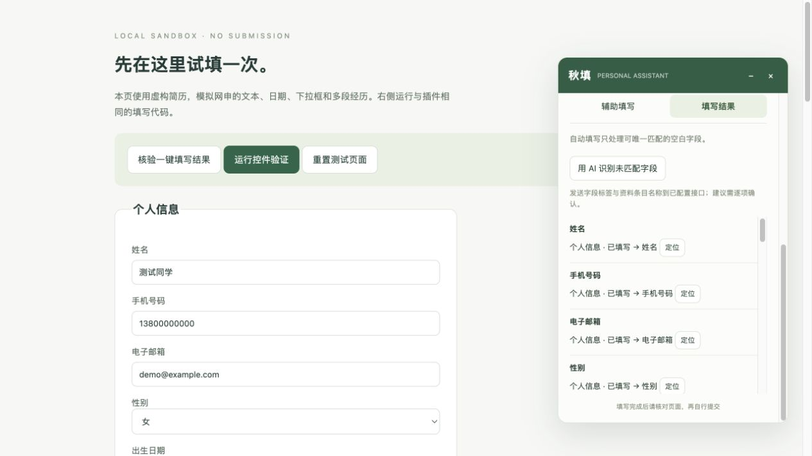

# 秋填 · 个人网申助手

Chrome / Edge 浏览器扩展，用本地简历资料减少校招网申的重复输入。基础功能无需账号、服务器或 AI Key，无需构建即可安装。

## 界面展示

以下为运行实际插件代码的本地演示截图，全部使用虚构资料。招聘表单为测试页面，不代表所有招聘网站的适配效果。

### 1. 整理简历资料

按类别管理个人信息和多段经历，保存后重复使用；支持切换不同岗位的简历版本。



### 2. 在网申页面打开助手

浮动面板提供一键填写、扫描、停止和撤销操作，可以拖动位置，填写时保留网页已有内容。



### 3. 一键填写与进度结果

本次演示实际填入 22 项资料，另有 2 项待处理。填写结束后可继续补填空白项，再自行核对和提交。



### 4. 点选辅助填写

搜索或按类别找到简历字段，先选择资料标签，再点击网页输入框；不便自动填写的控件也可使用复制。



### 5. 逐字段核对

查看每个字段的匹配和填写状态，点击“定位”找到对应输入框；未匹配的字段可以继续人工处理。



## 功能

- 多版本简历资料库，支持个人信息、教育、工作、实习、项目等 15 类资料。
- 扫描并填写可唯一匹配的空白字段，支持继续填写、进度、停止、结果定位与撤销。
- 字段搜索、分类和点选辅助填写，以及 JSON 导入导出。
- 北森表单适配：章节识别、部分自定义下拉、单选和日期控件。
- 可选兼容 Chat Completions 的 AI 接口，用于简历正文提取和字段匹配建议。

## 安装

1. 下载本仓库 ZIP 并解压，或克隆仓库。
2. 打开 `chrome://extensions/` 或 `edge://extensions/`，开启开发者模式。
3. 点击“加载已解压的扩展程序”，选择仓库内的 `extension` 文件夹。
4. 打开扩展，进入“管理我的简历”，录入并保存资料。
5. 进入招聘网站的表单页，打开助手，扫描后填写并核对结果。

更新后需在扩展管理页重新加载扩展，并在招聘页面刷新后重新打开助手。刷新前先保存网页上尚未保存的内容。

详细操作、全部资料字段、AI 配置、权限和兼容范围见 [使用说明](使用说明.md)。

## 数据与权限

简历和可选 API Key 保存在浏览器扩展本地存储中。仓库只包含虚构示例，不包含实际求职者资料。不同浏览器的资料不会自动同步。

基础填写使用本地规则。只有主动点击 AI 操作才请求配置的服务商：简历提取发送粘贴的正文；字段匹配发送字段标签与条目名称、分类、序号，不发送资料字段值。API Key 不包含在简历导出文件中。

使用 Manifest V3 的 `activeTab`、`scripting`、`storage` 权限，AI 接口域名按需授权。插件不自动提交申请。

## 0.1.2 更新

适配智联校园网申的家庭关系模块：支持 H6 标题和“必填”标记，拆分“姓名-父亲”“职位-父亲”“职务-母亲”等字段，按资料库中的父亲/母亲关系定位成员，不依赖记录顺序。增加家庭成员年龄字段和政治面貌下拉选择；亲属在指定单位任职等声明题保留人工处理。

先进入“家庭关系”模块并点击“编辑”，再打开助手填写。资料库中每位成员的“与本人关系”须明确填写，缺少的年龄、电话、政治面貌不会自动编造。已填写的网页内容保持原样。

## 0.1.1 更新

修复动态表单重建输入框后的漏填：对同一文档中可唯一确认、非重复经历的字段重新定位；新控件为空时最多重试一次。北森证件号码填写增加聚焦与失焦确认。整轮结束时重新检查已填字段，避免页面后续清空内容仍显示成功，并让撤销操作对应到保留内容的新控件。

在浏览器扩展管理页重新加载秋填即可加载更新。请先保存网申页面中未保存的内容，再刷新页面并重新打开助手；个人资料无需重新导入。

## 开发与验证

无第三方运行时依赖。

```sh
node tests/engine.test.cjs
node tests/background.test.cjs
python3 -m http.server 8765 --bind 127.0.0.1
```

本地浏览器测试页面：

- `http://127.0.0.1:8765/tests/demo.html`：原生控件与完整表单测试。
- `http://127.0.0.1:8765/tests/family.html`：7 组家庭关系模块、指定父母字段及下拉回归测试。
- `http://127.0.0.1:8765/tests/identity.html`：10 项证件号码动态表单回归测试。
- `http://127.0.0.1:8765/tests/beisen.html`：北森结构模拟测试。
- `http://127.0.0.1:8765/tests/options-preview.html`：资料管理演示。

浏览器演示使用模拟 Chrome API，测试代码不进入 `extension` 安装目录。当前 Node 测试包含 37 项匹配/数据测试和 6 项后台测试。

## 当前限制

当前版本为 0.1.2。真实页面结构已作适配参考，尚未完成真实简历在北森生产环境的整页验收。级联省市、多级专业树、部分动态控件与服务器校验仍可能需要手动操作。不能唯一匹配的字段留待辅助填写。

不自动新增经历、不直接解析 PDF/Word、不自动上传附件、勾选协议或提交申请。证件号码支持“身份证”等常见标签别名；证件类型独立匹配。

本项目独立实现通用网申辅助流程，与招聘平台或参考产品无隶属关系。

## 许可证

[MIT](LICENSE)
